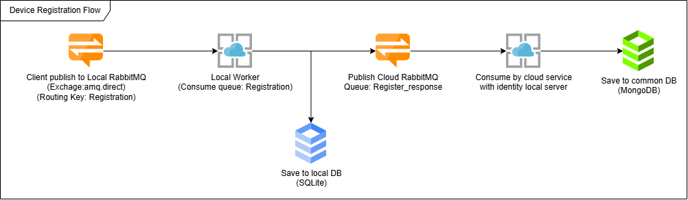
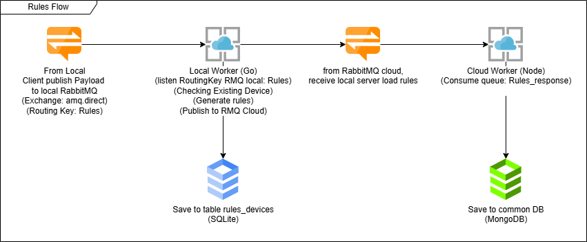

# HIOTO WORKER WITH FIBER FRAMEWORK 🚀

#### Developed by [M. Aji Perdana](https://github.com/ajiaja38) 

---

### What is this worker ?

Hey, so this is a microservice application designed for home automation with the Internet of Things (IoT). Users can register devices, control their operations, log them, and integrate them with global cloud applications. It's pretty cool because it allows comprehensive data logging from local servers through this worker.

We developed the worker using Go and SQLite, which were chosen for their efficiency. Go offers high performance with minimal resource consumption, which makes it suitable for distributed systems and high-throughput services. SQLite, being a lightweight database without the need for a separate server, ensures optimal data access speed and easy deployment without any additional complexity. This combination makes workers more responsive, lightweight, and easy to manage.

---

### How to use this worker ?

0. Clone this repository.
1. Install [Golang](https://go.dev/doc/install) 
2. Install [RabbitMQ](https://www.rabbitmq.com/) 
3. Enable RabbitMQ Management Plugin and RabbitMQ MQTT Plugin.
4. Create database file for this worker in your local machine, the database using SQLite in this project 
5. COPY .env.example to .env 
6. Fill in the .env file.
7. If you want to run the worker with Hot Reloading, please install [air](https://github.com/air-verse/air) first, and generate the .air.toml file with `air init` command
8. To build the worker, run `go build ./src/main.go` command.

---

### What's the features of this worker ?

1. Register, Control Device, update and delete device. This feature is can be used from local and cloud publisher rabbitmq.
2. Create Rules for control device SENSOR and ACTUATOR. Rules pattern have max 8 pattern with binary number combinations.
3. This worker have API endpoint for get all device, get detail device for checking device status, and control device from local server, check this [API Documentation](https://documenter.getpostman.com/view/15393804/2sAYdcsYTv).
4. This worker integrate with cloud publisher rabbitmq, so you can control device from cloud publisher client (Website).
5. Cron job for get all log and log aktuator every 10 minutes and publish to RabbitMQ cloud.

---

## Design System

### Registration Device Design System



---

### Control Device Design System


---

### Rules Design System


To manage rules, the client needs to publish a payload to the local rabbitMQ with a routingKey `Rules` on the `amq.direct` exchange. Here's the JSON format to use:

```json
{
  "input_guid": "68ea3da6-c04a-41ce-815e-a18392921f8b",
  "output_guid": [
    "e7dd51bd-32cf-4ca2-9bed-1efa36e21e38",
    "04e89950-271d-48e2-9111-5d1b04a75e71"
  ]
}
```

### Rules Explanation

1. **input_guid** is a unique GUID that represents the IoT **SENSOR** device.
2. **output_guid** is an array of unique GUID that represents the IoT **ACTUATOR** device.

### Example of the result

If the given length of the actuators is **2**, then the possible combinations are:

| Sensor | Actuator 1 | Actuator 2 |
| ------ | ---------- | ---------- |
| 00     | 1          | 1          |
| 01     | 1          | 0          |
| 10     | 0          | 1          |
| 11     | 0          | 0          |

---

### Payload Monitoring Device

The format for the monitoring device payload is like this: guid#payload. The "Monitoring" queue on RabbitMQ accepts this format.
Anything the device sends in this format is fine, depending on the type of device.

1. **Lights** -> ds490df5-d4c5-46df-551f-b29d61f82a78#0/1
2. **Temperature Sensor** -> ds490df5-d4c5-46df-551f-b29d61f82a78#23°C
3. **Water Level** -> ds490df5-d4c5-46df-551f-b29d61f82a78#HIGH/MEDIUM/LOW
4. **CCTV** -> ds490df5-d4c5-46df-551f-b29d61f82a78#image.jpg

---

### Service Autorun Using NSSM (the Non-Sucking Service Manager) for Windows Server

#### Service name: [hiotoGolang, hiotoDotnet]

1. Open the command prompt as an administrator.
2. Navigate to the directory where you have saved the nssm.exe file, for example: `C:\users\username\Documents\nssm\win64`.
3. To start the service, run the following command:

```bash
nssm start <service_name>
```

4. To stop the service, run the following command:

```bash
nssm stop <service_name>
```

5. To remove the service, run the following command:

```bash
nssm remove <service_name>
```

6. To check the status of the service, run the following command:

```bash
nssm status <service_name>
```

---

<p align="center">Best regards, <a href="https://github.com/ajiaja38" target="_blank">M. Aji Perdana</a></p>
